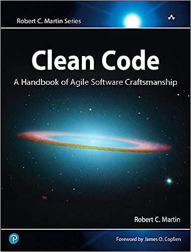
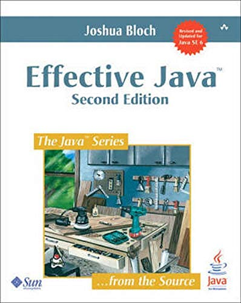
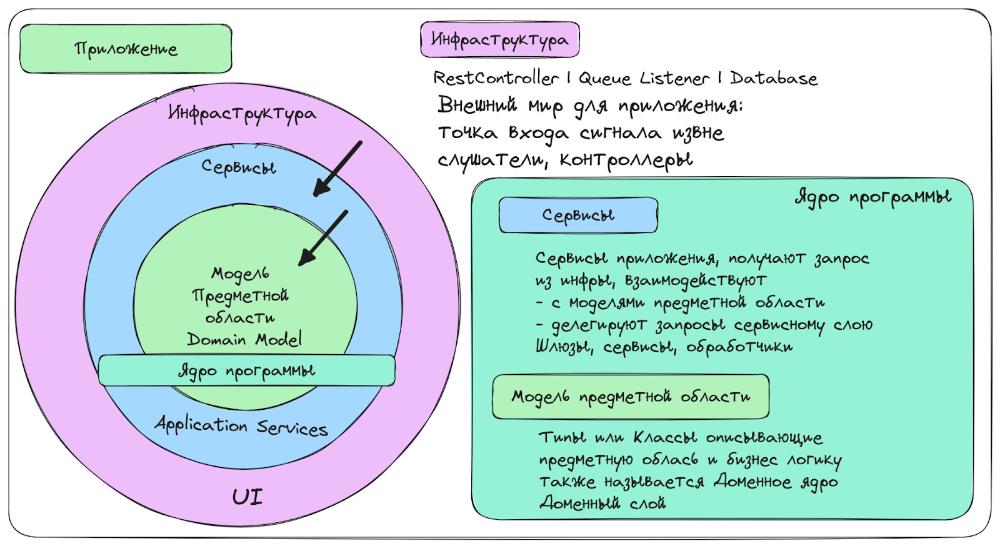

> ***[Статья на TProger](https://tproger.ru/articles/kak-napisat-chistyj-kod-i-sdelat-zhizn-proshhe)***

В университетах, как правило, рассказывают базовые понятия: алгоритмы и структуры данных, вычислительную математику. Но не про то, как красиво спроектировать приложение и сделать код удобочитаемым и пригодным для доработок. В итоге на практике мы часто получаем бессистемный подход и нечто, что трудно читать, сложно и страшно рефакторить. Потому что явно что-то где-то да упадёт.

Чтобы не допускать такого, мы запускаем серию статей про код, где подробно расскажем, как писать красиво и чисто и получать на выходе поддерживаемый код. В первой части расскажем, что такое чистый код и зачем он нужен и опишем принципы его создания. А дальше на конкретных примерах разберём, как делать надо и не надо.

1. [Да кому вообще нужен этот чистый код?](#first-part)
2. [Как написать чистый код?](#second-part)
3. [Подробное руководство](#third-part)
4. [Как править НЕ чистый код?](#fourth-part)

## <span id="first-part">Да кому вообще нужен этот чистый код?</span>

Читаемый, легко тестируемый, легко компонуемый код, который решает бизнес-задачу и сам является документацией, сокращает ТТM (time to market). За счёт времени, которое разработчик тратит на изучение приложения, внесение изменений в код, добавление новых фич и прочее.

И если приложение плохо спроектировано, код спутан — продуктивность команды, которой приходится разбираться с этим примерно 70% рабочего времени, падает. Это факт. И я с ним сталкивался.

Так что, по сути, он нужен всем, кто работает в IT.

### Разработчикам

В первую очередь для того, чтобы быстро анализировать и дорабатывать уже готовый код — в том числе собственный, написанный два месяца назад и благополучно за это время забытый. Так, сокращаем TTM.

К тому же, если мы плохо проектируем, плохо пишем, плохо автоматизируем, плохо доставляем, структура начинает тормозить, возникают ошибки. И приходят бизнес, лиды, тестировщики с претензиями, баг-репортами и доработками.

> Чистый и юзабельный код не ценность — а обязанность. И чем он однообразнее, скучнее и проще тем проще нам автоматизировать процессы.

### Лидам

Лиды, как и разработчики, отвечают за качество готового продукта. И им чистый код помогает быстрее проводить ревью, переключаться между задачами и следить за соблюдением соглашений.

> Бегите из команды, если ваш техлид говорит: «Чистый код — это миф. А те, кто пишут про него книги, статьи и доклады, не работают, а выдумывают теорию, которая на практике неприменима».

### Бизнесу

Бизнесу доклады про эстетику и красоту кода неинтересны. Бизнесу важна скорость появления фичей и отсутствие багов.

Так что чем быстрее работает команда, чем больше качественных продуктов и доработок она выпускает, тем больше бизнес может заработать.

## <span id="second-part">Хорошо, и как тогда написать чистый код?</span>

Сперва почитать хорошие книги
Да, лень — но надо. Всё хорошее и «правильное» уже придумано, и чтобы писать код грамотно, необязательно 5 лет изобретать велосипеды, как это делал я.

Рекомендую читать Роберта Мартина, Владимира Хорикова, Джошуа Блоха, Скота Влашина, Стива Макконнелла и стремиться к профессиональной простоте кодирования. Важно: старайтесь читать книги в оригинале.

<div style="display: flex; align-items:center; margin-bottom: 10px">
    
    <span style="margin-left: 1rem">Clean Code: A Handbook of Agile Software Craftsmanship</span>
</div>

<div style="display: flex; align-items:center; margin-bottom: 10px">
    
    <span style="margin-left: 1rem">Code Complete</span>
</div>

<div style="display: flex; align-items:center; margin-bottom: 10px">
    
    <span style="margin-left: 1rem">Effective Java (2nd Edition)</span>
</div>

<div style="display: flex; align-items:center; margin-bottom: 10px">
    
    <span style="margin-left: 1rem">Принципы юнит-тестирования</span>
</div>

<div style="display: flex; align-items:center; margin-bottom: 10px">
    
    <span style="margin-left: 1rem">Объекты: Стильное ООП</span>
</div>

> Важно понимать, что некоторые топики, которые тот же Мартин отстаивал в 2008, уже не актуальны. Советую отсеивать их и просто забирать полезное.

### Обратить внимание на принципы Unix

- Write programs that do one thing and do it well — Каждая программа, класс, функция выполняет одну задачу — и выполняет хорошо.
- Write programs to work together — Программы работают совместно, и мы можем выстроить пайплайн. Компоненты на разных уровнях работают вместе и взаимодействуют посредством классов.
- Write programs to handle text streams, because that is a universal interface — Программы взаимодействуют, используя универсальный текстовый интерфейс, а классы — код. Тип — универсальный интерфейс взаимодействия функций и классов.

Эти принципы помогают мне осознавать архитектуру в срезе сложного приложения, и проектировать программы/классы/функции.

> Unix-философия хорошо подходит для проектирования микросервисов (программ). Поэтому я рекомендую исследовать мир Unix и использовать Linux разработчикам.

## <span id="third-part">Внимательно прочитать руководство ниже</span>

Здесь я привёл основные рекомендации по написанию чистого кода, основанные на многих годах практики и книгах «Чистый код» и «Чистая архитектура: Руководство ремесленника по структуре и проектированию программного обеспечения».


### Всегда улучшайте код, с которым работаете

Мартин использует «Правило бойскаута» и призывает улучшать кодовую базу постоянно (так же, как бойскауты оставляют кемпинг в лучшем состоянии, чем он был до визита). Это очень важная жизненная идея.

Поддерживайте свой код в хорошем состоянии. Исправляйте ошибки как можно раньше, удаляйте неиспользуемый код и обновляйте его, чтобы он соответствовал новым требованиям.

И если нашли «сомнительную, странную дичь» в старом коде — соберите команду, обсудите то, что обнаружили. Вероятно, это «нечто» именно то, что стоит улучшить — или вовсе избавиться.

### Think twice, code once

Прежде чем приступить к разработке, доработке, рефакторингу, разберитесь в том, как функция/система работает по данному потоку. Станьте экспертом в предметной области.

### Используйте функциональную парадигму

Она загоняет нас в рамки чистого кода и способствует следовать лучшим практикам. Кроме того, чистое ООП в программах не нужно. Серьёзно, нет.

> Это тема для отдельной статьи, но тут поделюсь фактом: в нескольких больших банках функциональная парадигма — стандарт де-факто при написании микросервисов. И советую почитать, что Роберт Мартин пишет в блогеAnd the future is looking very functional to me.

### Делите код на слои

Каждый слой должен выполнять определённую функцию и быть независимым от других слоёв.

- Разделяйте логику и представление, чтобы упростить тестирование и обеспечить независимость компонентов.
- Используйте Вертикальное разделение. «Переменные, функции должны быть определены близко к тому месту, где они используются» (G10 Vertical Separation Clean Code, page 292).
- Опирайтесь на луковичную архитектуру, где внутренний слой ничего не знает о внешнем — это помогает визуализировать и проектировать структуру приложения.



Как написать чистый код и сделать жизнь проще 3
Пара материалов по теме:

- [5 essential patterns of software architecture](https://www.redhat.com/architect/5-essential-patterns-software-architecture#layered)
- [14 software architecture design patterns to know](https://www.redhat.com/architect/14-software-architecture-patterns)
- [The Onion Architecture : part 1](https://jeffreypalermo.com/2008/07/the-onion-architecture-part-1/)

### Соблюдайте принципы SOLID для проектирования сервисов, классов и функций

Нам особенно важен «Принцип единственной ответственности (Single Responsibility Principle)» для классов и функций, сервисов:

> «Каждый класс или функция должны выполнять только одну задачу»

То есть пишите функции, которые делают только одну вещь — и делают её хорошо. Есть несколько способов убедиться, что выполнили это правило:

- функция выполняет только те действия, которые находятся на одном уровне с объявленным именем, выполняет задачу как бы замкнуто в своём теле; и если какие-то запросы пролетают наружу, как это бывает в функциях сервисов приложений, то через шлюзы;
- функция выполняет действия, которые находятся на одном уровне абстракции;
- из одной функции не получается выделить другие;
- функцию не получается разделить на секции.

### Избегайте наследования

Сложные иерархии наследования приводят к путанице и проблемам отладки. Постарайтесь ограничить сложность класса, сохраняя связанную функциональность вместе, а не распределяя её по нескольким уровням абстракции.

### Предпочитайте полиморфизм операторам If/Else

Приложение будет более гибким, если мы вынесем поведение в классы, убрав тем самым бизнес логику принятия решений, ветвлений в родственные доменные классы.

### DRY

Код должен быть повторно использован только тогда, когда имеет ту же ответственность.

Если вы используете один и тот же код несколько раз, выносите его в отдельную функцию (класс, компонент, сервис) чтобы избежать дублирования и упростить поддержку.

> Не увлекайтесь DRY при написании тестов. Универсальность в них часто уменьшает читабельность, а значит, ясность. Помните, тест — это документация.

### Классы не должны знать о внутренней реализации других классов

Не думайте о внутренней работе юнита (класса, функции) — лучше смотреть на него, как на чёрный ящик. Это поможет при проектировании и писании прекрасно тестируемого кода.

### G22: Make Logical Dependencies Physical

Если один модуль зависит от другого, эта зависимость должна быть физической, а не только логической. Также зависимость должна быть очевидной

### Используйте понятные и описательные имена

Для всего: переменных, функций, классов и других элементов кода. Избегайте сокращений и аббревиатур.

### Форматируйте код

Казалось бы, очевидное правило. Но как показывает практика — нет. Поэтому:

- открыли класс в Idea, нажали Ctrl + Alt + L, продолжаем работу;
- одной пустой строки в отступах между блоками в коде достаточно.

> Современные IDE умеют форматировать перед коммитом или при сохранении файла. Но лучше один раз вручную установить стандарт — и потом придерживаться его средствами автоматизации.

### Опирайтесь на 3 закона TDD

- You may not write production code until you have written a failing unit test — Мы не выпускаем в прод код, который не покрыт тестами.
- You may not write more of a unit test than is sufficient to fail, and not compiling is failing — Покрываем тестами код в достаточном количестве, чтобы убедиться, что данный слой (класс, функция) работает верно. Не дублируйте тест кейсы на разных уровнях.  
  Если все сделали правильно: покрыли юнит-тестами бизнес-логику, не нужно дублировать проверку всех бизнес-кейсов интеграционными тестами.
- You may not write more production code than is sufficient to pass the currently failing test — Написал код — написал тесты. Или в обратном порядке.

> Эти законы можно интерпретировать и использовать и тем, кто не придерживается каноничного TDD.

### Не используйте исключения для обработки ошибок

Мартин рекомендовал в своё время использовать исключения. А я — нет. Исключения для нас — только сигналы багов. А для обработки ошибок мы используем [R.O.P](https://fsharpforfunandprofit.com/rop/).

### Комментарий — признак плохого кода

Пишите комментарии внутри кода только тогда, когда они объясняют, не что код делает, а почему он написан таким образом.

> Общее правило для большинства случаев: если вам приходится добавлять комментарии — перепишите код.

### Задавайте границы для внешних библиотек и систем
Оборачивайте внешние библиотеки или API в API который подходит вашему дизайну — это даст запас прочности.

Применяйте[ Anti-corruption Layer pattern](https://learn.microsoft.com/en-us/azure/architecture/patterns/anti-corruption-layer) в дизайне кода. И используйте юнит-тесты.

### Живите в парадигме Null Safety

Не передавайте null

Не возвращайте null

Не используйте null

### Размер функции или метода — максимум пять строк

Об этом пишет Кристиан Клаусен в книге «Пять строк кода» которую Роберт Мартин рекомендует.

> Сам Мартин указывает, что размер функции не должен превышать 20 строк по 150 символов каждый, но чем меньше — тем лучше.

### Идеальное количество входных параметров для функции — один

Параметры усложняют функцию и запутывают её восприятие. Особенно это касается выходных — потому что мало кто ожидает, что функция в аргументах будет возвращать значения. Поэтому:

- функция не преобразует входной аргумент;если вы видите такую функцию или написали её только что, исправьте — результат изменения нужно передавать в возвращаемом значении — и точка;
- некоторые аргументы стоит упаковать в отдельном классе — так советует старина Блох, отец Макконэл, советую я.

### Отделите бизнес-логику предметной области от логики приложения

Например, бизнес-правила, консистентное состояние объектов в системе, проверки ограничений (валидация), расчёты, используемые в решении, не следует путать с техническими деталями, такими как схема базы данных, интеграции с внешними системами, сервисами уровня приложений и уровнем DTO.

Наконец, помните, что написание чистого кода — это ремесло и где-то даже искусство, которое требует практики и терпения. Не бойтесь переписывать код, если это поможет улучшить его качество и поддерживаемость. А если ищете элегантное простое решение, смотрите [кукбук](https://habr.com/ru/companies/gazprombank/articles/722620/).

### Опирайтесь на Объекты-значения
Объекты-значения сами по себе стоит рассматривать как типы наравне со стандартными типами языка, например
String, int и т.п. Создавая новые объекты для представления понятий, вы расширяете систему типов.

Базовый кирпичик моделирования предметной области.
Стандартый класс или примитив нам ничего не говорит про ограничения имени:
```kotlin
data class Client (val name: String)
```
Тогда как объект-значение гарантирует свое валидное состояние и его безопасно использовать как элемент, более сложного класса(типа):
```kotlin
data class Name private constructor(val value: String) {
    companion object {
        private val CYRILLIC_NAME_PATTERN = Regex("^[а-яА-я]{9}$")

        fun emerge(name: String): Result<String> {
            return if (CYRILLIC_NAME_PATTERN.matches(name)) {
                Result.success(name)
            } else {
                Result.failure(RuntimeException("Некорректное имя"))
            }
        }
    }
}
```

## <span id="fourth-part">А если мне попал в руки НЕ чистый код?<span>

Тогда начинаем рефакторинг. Я использую такой алгоритм:

- Просматриваем приложение сверху вниз, оцениваем насколько оно хорошо спроектировано и как описаны классы.
- Узнаем у автора этого непотребства, что делает сервис.
- Открываем Readme и в функциональном стиле описываем назначение сервиса. Нам пригодятся [Markdown Best practices](https://www.markdownguide.org/basic-syntax/). Лучше визуализировать процесс (например, с помощью [ExcaliDraw](https://excalidraw.com/)) это поможет представить правильную картину и структуру классов.
- Продумываем, как будем всё это тестировать. Если всё выглядит совсем монструозно, я предлагаю воспользоваться дорогими, но покрывающими максимум кода интеграционными тестами. Раз уж это творение орков работает, зафиксируем состояние и покроем крайние точки тестами. Проверенная тактика.
- Во время рефакторинга сразу покрываем код юнит-тестами.
  На выходе получим простой элегантный дизайн в функциональной парадигме, которая способствует следованию хорошим принципам дизайна и рекомендациям Мартина в частности.

# Выжимка: Стильный код

- [ ] [Обратить внимание на принципы Unix](#обратить-внимание-на-принципы-unix)
- [ ] [Всегда улучшайте код, с которым работаете](#всегда-улучшайте-код-с-которым-работаете)
- [ ] [Think twice, code once](#think-twice-code-once)
- [ ] [Используйте функциональную парадигму](#используйте-функциональную-парадигму)
- [ ] [Делите код на слои](#делите-код-на-слои)
- [ ] [Соблюдайте принципы SOLID для проектирования сервисов, классов и функций](#соблюдайте-принципы-solid-для-проектирования-сервисов-классов-и-функций)
- [ ] [Избегайте наследования](#избегайте-наследования)
- [ ] [Предпочитайте полиморфизм операторам If/Else](#предпочитайте-полиморфизм-операторам-ifelse) 
- [ ] [DRY](#dry)
- [ ] [Форматируйте код](#форматируйте-код)
- [ ] [Классы не должны знать о внутренней реализации других классов](#классы-не-должны-знать-о-внутренней-реализации-других-классов)
- [ ] [понятные и описательные имена](#используйте-понятные-и-описательные-имена)
- [ ] [Опирайтесь на 3 закона TDD](#опирайтесь-на-3-закона-tdd)
- [ ] [Не используйте исключения для обработки ошибок](#не-используйте-исключения-для-обработки-ошибок)
- [ ] [Комментарий — признак плохого кода](#комментарий--признак-плохого-кода)
- [ ] [Задавайте границы для внешних библиотек и систем](#задавайте-границы-для-внешних-библиотек-и-систем)
- [ ] [Живите в парадигме Null Safety](#живите-в-парадигме-null-safety)
- [ ] [Размер функции или метода — максимум пять строк](#размер-функции-или-метода--максимум-пять-строк)
- [ ] [Идеальное количество входных параметров для функции — один](#идеальное-количество-входных-параметров-для-функции--один)
- [ ] [Отделите бизнес-логику предметной области от логики приложения](#отделите-бизнес-логику-предметной-области-от-логики-приложения)
- [ ] [Опирайтесь на объекты значения](#опирайтесь-на-объекты-значения)
