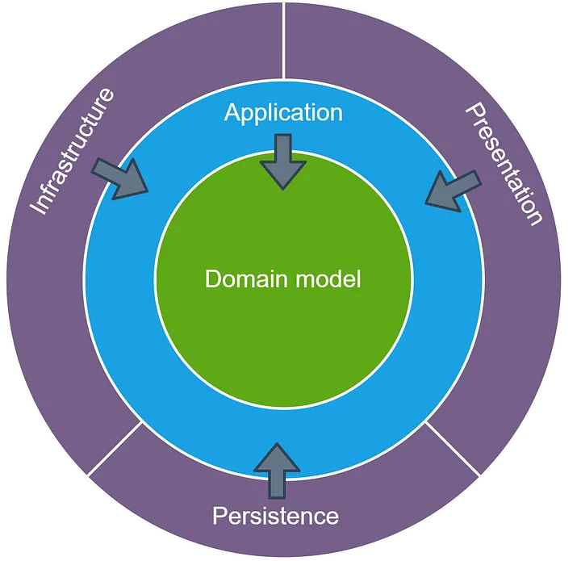

# Onion Architecture
Привет. 
Статью я написал после того, как в [Бэкенд академи](https://gpb.fut.ru/itfactory/backend) показал пример проектирования простого приложения студентам. 

Я обратил внимание, что не просто донести суть разделения на слои приложения новичкам. 
Вопросы, которые мне казались простыми - совсем не очевидны джунам. Что логично, но не всегдя очевидно старшему разработчику.  


В статье я собрал описание Луковой архитектуры, отсылки к первоисточникам. 
Акцентировал внимание на важной идее про отделение приложения от базы данных.
Ответил на вопросы: 
- Какую задачу решает разделение на слои?  
- Какую задачу решаем на каждом слое?

  
Добавил исходный код и описание структуры папок для тех, кто как и я предпочитает читать гит и исследовать исходный код.

Статья для самых маленьких и таит в себе основу проектирования надежного софта.  


Все что описано в этой статье - работает в реальных проектах.  
[Код приложения](https://github.com/codemonstersteam/onion-architecture) написан для того, чтобы под рукой у тебя был исходник, который поможет разобраться в основе, научиться проектировать и писать правильный код.
Я уверен, что код - это хорошее дополнение к тексту и поможет тебе разобраться в теме. 
Если бы я нашел такой пример, когда искал пути создания надежного тестируемого кода в книгах и курсах, я потратил бы меньше времени на поиски ответов.  
Забирай и применяй.    
Dev2Dev.  

Впервые о Луковой Архитектуре написал [в статье Jeffrey Palermo в ярком 2008-ом](https://jeffreypalermo.com/2008/07/the-onion-architecture-part-1/)

Луковая архитектура — это архитектурный шаблон программного обеспечения, 
который обеспечивает модульную и слабосвязанную конструкцию, 
уделяя особое внимание изолированию бизнес-логики, разделению задач, удобству сопровождения.

Правильное изолирование бизнес-логики помогает разработчикам создавать более гибкие и надежные приложения.  
При таком подходе бизнес-логику приложения просто тестировать и, как следствие, такой приклад легче развивать с течением времени. 
В этой статье мы углубимся в ключевые концепции луковой архитектуры.   
Рассмотрим пример структуры папок, иллюстрирующий ее реализацию.

#  Ключевые концепции Луковой Архитектуры
В самом центре мы видим модель предметной области, которая представляет собой комбинацию состояния и поведения, 
моделирующую бизнес-процесс.  



Вокруг модели предметной области существуют другие уровни приложения. 
Количество слоев в ядре приложения может различаться.  
Самое вежное для нас - **Модель предметной области**, которая расположена в самом центре.
Поскольку все связи направлены к центру, **модель предметной области связана только сама с собой**. 

На краю "Луковицы" обычно располагаем интерфейсы, обеспечивающие сохранение и извлечение объектов.
В примере кода эти интерфейсы представлены Шлюзами ([ClientGateway](src/main/kotlin/team/codemonsters/code/walletRegistration/application/ClientGateway.kt), [WalletGateway](src/main/kotlin/team/codemonsters/code/walletRegistration/application/WalletGateway.kt)). 
Это так называемый уровень Шлюзов и Адапперов. 
**Важно**, обратите внимание на это - поведение сохранения объектов (ClientGateway) не является ядром приложения, 
поскольку оно обычно задействует базу данных.  

В ядре приложения находится только интерфейс для работы с этим слоем.  
По краям мы видим пользовательский интерфейс, инфраструктуру.  
Внешний слой предназначен для вещей, 
которые часто меняются. 
Например, мы используем интерфейс командной строки, чтобы запустить бизнес-процесс.  
Мы можем легко доработать приложение и добавить интерфейс взаимодействия с приложением по REST API.  

API интерфейс, инфру следует намеренно изолировать от ядра приложения. 
На краю луковицы мы найдем класс, реализующий интерфейс репозитория. 
Этот класс привязан к определенному методу доступа к данным и поэтому находится вне ядра приложения. 

## Правило зависимости:

Зависимости текут внутрь, при этом внутренние уровни не имеют информации о внешних слоях. Это гарантирует, что модули в центре, которые реализуют бизнес-логику не зависят напрямую от модулей уровня инфраструктуры. Это обеспечивает взаимозаменяемость внешних реализаций и уменьшает связанность бизнес-логики и инфры.

## База данных не является центром. Это внешний слой.

Вынесение наружу базы данных может стать значительным изменением для некоторых людей, 
привыкших думать о приложениях как о «приложениях баз данных».  

Это очень важный свдиг парадигмы восприятия проектирования приложения. 
Много новичков и старичков привыкли воспринимать приложения как «приложения баз данных».  
Разработчики теряют важную суть моделирования бизнес-процесса, не могут пробиться к пониманию зачем нам эти абстракции и какую задачу они решают при проектировании.  

Задачу моделирования бизнес-процесса.  

В луковой архитектуре нет приложений баз данных. Существуют приложения, которые могут использовать базу данных в качестве службы хранения, но только через код внешней инфраструктуры, реализующий интерфейс, **имеющий смысл для ядра приложения**.   
Отделение приложения от базы данных, **позволяет сконцентророваться на моделировании бизнес-процесса** и описать бизнес-логику (use-case), бизнес-правила (business-rules) объектами.   

Отделение приложения от инфры, базы данных, файловой системы и т. д. снижает стоимость обслуживания и, что важнее, смещает фокус на самую главную задачу, которую мы решаем.
**Задачу моделирования бизнес-процесса**.  

Объекты мы будем тестировать юнит-тестами, а значит вся бизнес-логика у нас покрыта юнит-тестами.  

100% покрытие бизнес-логики юнит-тестами - это недооцениваемый подарок данного подхода к проектированию, который многие разработчики не видят.  
Подход ведет нас прямиком к сбалансированной Пирамиде Тестирования, надежному софту и качественному ИТ производству.  

Качество достигается за счет минимизации времени на сборку и тестирование, что в скою очередь приводит к сокращению ТТМ (Time to Market) и сокращению количества инцидентов, которые связаны с ошибками проектирования и тестирования.  


Обратите внимание,  
Я не просто так пишу именно про Луковую Архитектуру, не Чистую или Гексагональную.  
Это не случайность.  
Огромное количество кодовой базы разработано без учета этих рекомендаций, что приводит к усложнению кода и тестирования.  

Alistair Cockburn написал о [гексагональной архитектуре](http://alistair.cockburn.us/index.php/Hexagonal_architecture)   
Гексагональная архитектура и луковая архитектура имеют общую предпосылку: вынести инфраструктуру наружу и написать код адаптера, чтобы инфраструктура не становилась тесно связанной. 
В Луковой Архитектуре впервые акцент был направлен на проектирование бизнес-логики, а уровень хронения объектов - это просто внешний слой.
Мне очень нравятся ценные первоисточники.  


## Разделение границ
Каждый уровень имеет четкую ответственность, гарантируя, 
что бизнес-логика остается отделенной от проблем инфраструктуры или представления. 
Такое разделение повышает удобство сопровождения кода и облегчает тестирование самого важного кода - кода, который таит в себе бизнес-логку.

## Слои приложения
- Слой Предметной Области (Domain Layer): Содержит бизнес-логику, бизнес-правила приложения.  
- Уровень приложения (Application Layer): Описывает бизнес-сценарий (use-case), взаимодействует с уровнями предметной области и инфраструктуры.  
- Уровень инфраструктуры (Infrastructure Layer): Управляет внешними для приложения зависимостями, такими как базы данных, файловые системы или внешние службы (Web-сервисы).  
- Уровень представления (Presentation Layer): Управляет пользовательскими интерфейсами. Точка входа нашего приложения для запуска бизнес-процесса. Например, REST API, терминал.


## Пример структуры папок:

### Слой предметной-области (Domain Layer):
Реализует Бизнес-сценарий (use-case) и Бизнес правила в объектах (business-rules)  

Пример папок:  

> src/domain/model


### Уровень приложения (Application Layer):
Реализует бизнес-процесс (use-case). 
Управляет взаимодействием между уровнем предметной области и инфраструктуры во время исполнения бизнес-процесса.

Примеры папок:   

> src/application/service  
> src/application/usecase  
> src/application/usecase/service  


### Уровень инфраструктуры (Infrastructure Layer)

Реализует взаимодействие с внешними зависимости и технические детали.  

Примеры папок: 

>src/infrastructure/persistence  
>src/infrastructure/service #rest, queue

 
## Преимущества луковой архитектуры:
### Модульность и Простота сопровождения:
Четкое разделение задач и разделение зависимостей упрощают сопровождение и модификацию кода, 
делая его более адаптируемым к меняющимся требованиям.

### Тестируемость:
Каждый уровень может быть протестирован независимо. 
Позволяет проводить комплексные модульные тесты (unit tests) и гарантировать, 
что бизнес-логика остается изолированной от внешних зависимостей и **покрыта 100% юнит-тестами**.

### Гибкость
Модульная конструкция облегчает внедрение новых фрэймворков и инструментов (переход с IBM MQ, Kafka), 
не затрагивая бизнес-логику,  
повышая масштабируемость и устойчивость приложения.


----

# Пример приложения в исходнике

Есть три важные идеи, которые упускают даже опытные разработчики с 20-ти летним стажем.  

1. Бизнес логика описана в неизменяемых классах. Тестируется юнит-тестами.
2. Сервисный класс не содержит бизнес-правила, он описывает поток исполнения бизнес-сценария. Простой оркестратор.
   - Взаимодействует с моделями предметной области. Центр Луковицы.  
   - Взаимодействует с внешним миром по бизнес-сценарию через шлюзы.  
     
   _Код такого сервиса тривиален и его можно не тестировать._
3. База данных не является центром приложения. Мы не думаем о приложениях как о «приложениях баз данных». Мы моделируем бизнес-процесс в моделях(Классах), описываем use-case в простейшем сервисе. Сервис взаимодействует с внешним миром через Шлюзы. 
 

### Визуализация потока управления (control-flow)


### Описание потока управления программы:  
1. Приложение получает запрос из внешнего мира (DTO) [TerminalApp.kt](src%2Fmain%2Fkotlin%2Fteam%2Fcodemonsters%2Fcode%2FwalletRegistration%2Fpresentation%2FTerminalApp.kt)    
2. [Транслирует данные из DTO в модель, которая описывает непроверенный запрос](https://git.codemonsters.team/guides/effective-code/-/blob/main/src/main/kotlin/team/codemonsters/code/walletRegistration/presentation/TerminalApp.kt#L23)   
3. Передает данные упакованные в Непроверенный запрос в Сервис Приложения [WalletRegistrationService.kt](src%2Fmain%2Fkotlin%2Fteam%2Fcodemonsters%2Fcode%2FwalletRegistration%2Fapplication%2FWalletRegistrationService.kt#L16)    
4. Исполняем бизнес-логику (use-case) в сервисе уровня приложения [WalletRegistrationService.kt](src%2Fmain%2Fkotlin%2Fteam%2Fcodemonsters%2Fcode%2FwalletRegistration%2Fapplication%2FWalletRegistrationService.kt#L16)    
   5. [Проверяем данные, которые пришли на вход и создаем валидную модель](https://git.codemonsters.team/guides/effective-code/-/blob/main/src/main/kotlin/team/codemonsters/code/walletRegistration/application/WalletRegistrationService.kt#L17)   
   6. [Ищем клиента по идентификатору: используем ClientGateway](https://git.codemonsters.team/guides/effective-code/-/blob/main/src/main/kotlin/team/codemonsters/code/walletRegistration/application/WalletRegistrationService.kt#L23)  
   7. [Регистрируем кошелек в системе управления кошельками: используем WalletGateway](https://git.codemonsters.team/guides/effective-code/-/blob/main/src/main/kotlin/team/codemonsters/code/walletRegistration/application/WalletRegistrationService.kt#L27)      
   8. Привязываем кошелек к клиенту и возвращаем результат операции [WalletRegistrationService.kt](src%2Fmain%2Fkotlin%2Fteam%2Fcodemonsters%2Fcode%2FwalletRegistration%2Fapplication%2FWalletRegistrationService.kt#L38)  
9. Транслируем ответ из сервиса приложения в контракт API [TerminalApp.kt](src%2Fmain%2Fkotlin%2Fteam%2Fcodemonsters%2Fcode%2FwalletRegistration%2Fpresentation%2FTerminalApp.kt#L27)    


## 1. Уровень представления
### Какую проблему решает:  
Реализует публичный API приложения.  

Является Точкой входа в приложение. Инициирует исполнение бизнес-сценария.  

Пример публичного API:
- терминал
- REST API
- Подписка на очередь сообщений
и т.п. RPC подобные входы.

В нашем примере это: [TerminalApp.kt](src%2Fmain%2Fkotlin%2Fteam%2Fcodemonsters%2Fcode%2FwalletRegistration%2Fpresentation%2FTerminalApp.kt)

В такой архитектуре легко добавить дополнительную точку входа. Нужно просто подобрать адаптер.

### Что делаем на этом уровне?
1. Получаем запрос извне (ДТО)
2. Формируем из ДТО валидный запрос для сервиса приложения. 
     Проверяем запрос согласно бизнес-правилам доменной модели, которые описаны в API сервиса приложения.
     Транслируем результат ошибки при валидации в понятный ответ нашего API  
3. Передаем управление сервису приложения  
4. Транслируем результат работы сервиса в понятный ответ согласно API  

[WalletRegistrationService.kt](src%2Fmain%2Fkotlin%2Fteam%2Fcodemonsters%2Fcode%2FwalletRegistration%2Fapplication%2FWalletRegistrationService.kt)


## 2. Уровень приложения
Сервис приложения и шлюзы (адаптеры)

## 2.1 Сервис приложения
### Какую проблему решает:

Сервис приложения реализует бизнес-сценарий (use-case) по шагам и обеспечивает консистентность выполнения бизнес-сценария.  
Взаимодействует с консистентными моделями предметной области в которых описаны бизнес-правила
и передает управление на уровень инфраструктуры через Шлюзы, чтобы получить модели предметной области и передать их в уровень хранения.

#### Класс сервиса:  
Сервис Регистрации Кошелька
[WalletRegistrationService.kt](src%2Fmain%2Fkotlin%2Fteam%2Fcodemonsters%2Fcode%2FwalletRegistration%2Fapplication%2FWalletRegistrationService.kt)  

### Что делаем на этом уровне?
1. Исполняем бизнес-сценарий шаг за шагом (use-case)
2. Получаем нужные данные из шлюзов в виде моделей предметной области
3. Отправляем данные в шлюзы на сохранение или для запуска исполнения внешнего процесса по бизнес-сценарию в виде моделей предметной области

## 2.2 Шлюзы: 
Уровень щлюзов, адаптеров обеспечивает взаимодействие с внешними системами (веб сервисы, очереди, и т.п.) 
и уровнем хранения (база данных)
[ClientGateway.kt](src%2Fmain%2Fkotlin%2Fteam%2Fcodemonsters%2Fcode%2FwalletRegistration%2Fapplication%2FClientGateway.kt)  
Для чего:
1. Чтобы получить модели предметной области
2. Чтобы передать модели предметной области во внешний мир, в том числе для сохранения.

### Что делаем на этом уровне?
Делаем только то, что нужно по бизнес-процессу. Ниже я подробнее расписал шаги.  
По своей сути шлюзы транслируют запрос из ядра предметной области во внешний мир и обратно.  

### Справка: Шлюзы и Адаптеры
Я хочу остановиться на отличиях Шлюза от Адаптера. Бог кроется в деталях.  

[Martin Fowler](https://martinfowler.com/articles/gateway-pattern.html) уже все сделал до меня:  


> Адаптер — это наиболее близкий к шлюзу шаблон GoF, поскольку он изменяет интерфейс одного класса в соответствии с другим.
> 
> Адаптер определяется в контексте уже **присутствующих обоих интерфейсов**, тогда как в случае со шлюзом я определяю интерфейс шлюза при обертывании внешнего элемента. Это различие заставило меня рассматривать шлюз как отдельный шаблон. Со временем люди начали использовать слово «адаптер» гораздо более широко, поэтому нередко можно увидеть шлюзы, называемые адаптерами.


#### Получаем данные для сервиса приложения:

[ClientGateway.kt](src%2Fmain%2Fkotlin%2Fteam%2Fcodemonsters%2Fcode%2FwalletRegistration%2Fapplication%2FClientGateway.kt) > findClient

1. Получаем запрос из Сервиса Приложения в виде модели предметной области
2. Транслируем запрос из модели предметной области в соответствующий запрос для инфраструктурного сервиса (DTO, DB Entity)
3. Передаем запрос в инфраструктурный сервис
4. Транслируем ответ от инфраструктурного сервиса (DTO, DB Entity) в консистентную модель предметной области
5. Возвращаем ответ в виде модели предметной области [domain](src%2Fmain%2Fkotlin%2Fteam%2Fcodemonsters%2Fcode%2FwalletRegistration%2Fdomain)

#### Отправляем данные из сервиса приложения. Например: сохраняем модель в базе данных.
[ClientGateway.kt](src%2Fmain%2Fkotlin%2Fteam%2Fcodemonsters%2Fcode%2FwalletRegistration%2Fapplication%2FClientGateway.kt) > registerWallet

1. Получаем запрос из Сервиса Приложения в виде модели предметной области
2. Транслируем запрос из модели предметной области в соответствующий запрос для инфраструктурного сервиса (DTO, DB Entity)
3. Передаем запрос в инфраструктурные сервис
4. Транслируем ответ от инфраструктурного сервиса в консистентную модель предметной области
5. Возвращаем ответ в виде модели предметной области [domain](src%2Fmain%2Fkotlin%2Fteam%2Fcodemonsters%2Fcode%2FwalletRegistration%2Fdomain)

## 3. Уровень инфраструктуры
### Какую проблему решает:
Обеспечивает взаимодействие с внешним миром для приложения.

### Что делаем на этом уровне?

1. Интеграция с Базой Данных:  
   [ClientRepository.kt](src%2Fmain%2Fkotlin%2Fteam%2Fcodemonsters%2Fcode%2FwalletRegistration%2Finfrastructure%2FClientRepository.kt)

2. Клиенты для взаимодействия с веб-сервисами по REST API, брокерами сообщений, SOAP, smtp, и т.п.


## 4. Уровень модели предметной области (Domain Layer)
[domain](src%2Ftest%2Fkotlin%2Fteam%2Fcodemonsters%2Fcode%2FwalletRegistration%2Fdomain)

На этом уровне мы тщательно моделируем бизнес-процесс (MODEL DRIVEN DEVELOPMENT). 
Описываем бизнес-правила в объектах-значениях [ClientId.kt](src%2Fmain%2Fkotlin%2Fteam%2Fcodemonsters%2Fcode%2FwalletRegistration%2Fdomain%2FClientId.kt) 
и описываем более сложные отношения моделей в агрегирующих моделях [ClientWithWallet.kt](src%2Fmain%2Fkotlin%2Fteam%2Fcodemonsters%2Fcode%2FwalletRegistration%2Fdomain%2FClientWithWallet.kt) и бизнес-сущностях [ClientWithoutWallet.kt](src%2Fmain%2Fkotlin%2Fteam%2Fcodemonsters%2Fcode%2FwalletRegistration%2Fdomain%2FClientWithoutWallet.kt), [WalletRegistrationRequest.kt](src%2Fmain%2Fkotlin%2Fteam%2Fcodemonsters%2Fcode%2FwalletRegistration%2Fdomain%2FWalletRegistrationRequest.kt)


### Какую проблему решает:
Самую главную задачу - Моделирование бизнес-логики. Описываем бизнес-правила (business-rules).
Тестируем бизнес-логику юнит-тестами.  


### Что делаем на этом уровне?
Описываем модели предметной области, бизнес-правила в моделях и отношения моделей.
Гарантируем изоляцию моделей предметной области от инфры.

Модели предметной области знают только о моделях предметной области.

### Пример класса Клиент без кошелька:
[ClientWithoutWallet.kt](src%2Fmain%2Fkotlin%2Fteam%2Fcodemonsters%2Fcode%2FwalletRegistration%2Fdomain%2FClientWithoutWallet.kt)

````kotlin
data class ClientWithoutWallet(
    val clientId: ClientId,
    val name: Name,
    val walletId: WalletId
) {

    companion object {
        fun emerge(clientId: String, name: String, walletId: String?): Result<ClientWithoutWallet> {
            val validClientId = ClientId.emerge(clientId)
            if (validClientId.isFailure)
                return Result.failure(validClientId.exceptionOrNull()!!)

            val validName = Name.emerge(name)
            if (validName.isFailure)
                return Result.failure(validName.exceptionOrNull()!!)


            if (null == walletId) {
                return Result.success(ClientWithoutWallet(validClientId.getOrThrow(), validName.getOrThrow(), WalletId.Empty))
            }
            return Result.failure(RuntimeException("У клиента уже есть кошелек"))
        }
    }
}
````

# Делать правильно - это долго и дорого
Нет. Ради всего святого, это ускорит тебя со временем.
Есть графики у Владимира Хорикова и Мартина Фоллера, которые наглядно показывают, что на начальном этапе накидать говна и палок - быстро и дешево, но в долгосрочной перспективе это не выгодно и стоимость поддержки возрастает. Именно так это работает. Делайте чаще релизы - улучшайте решение со временем.

Качественное решение уверенно можно развивать и поддерживать не просаживаясь по времени на доставку и не плодя ошибок проектирования и тестирования.
Да я понимаю, что сразу делать правильно не просто. 
В любом мастерстве есть базовые вещи без которых не будет развития.  
Изолированная бизнес-логика, которую можно тестировать юнит-тестами - это цель.
Объекты значения - это база.  

В единоборствах база - это стоять в равновесии на одной ноге, включать правильные мышцы и переносить баланс.  

Сначала может быть не просто, но если ты поймешь какую задачу решать на каком слое, как моделировать бизнес-процессы консистентными объектами - ты начнешь преуспевать в качестве с малым TTM (time to market). 
Ты сможешь запускать тесты без задержек.  
Ты сможешь тестировать бизнес-правила без пользовательского интерфейса и внешних API.  
Такая гибкость и отсутствие связности всегда тебя ускоряют.  
Меня ускорила - ускорит и тебя.  
Есть одна вещь, которую мы уяснили о связывании за последние десятилетия - 
связывание это лучшее, что может тебя замедлить в разработке.  

Связные релизы - это то, что тебя замедляет.  
Знай это.  
Делай изменение как можно чаще, делай это правильно.  


## Links  
- [Onion Architecture: Первоисточник Jeffrey Palermo 2008](https://jeffreypalermo.com/2008/07/the-onion-architecture-part-1/)
- [Clean Architecture](https://blog.cleancoder.com/uncle-bob/2011/11/22/Clean-Architecture.html)
- [Clean Architecture](https://herbertograca.com/2017/09/28/clean-architecture-standing-on-the-shoulders-of-giants/)
